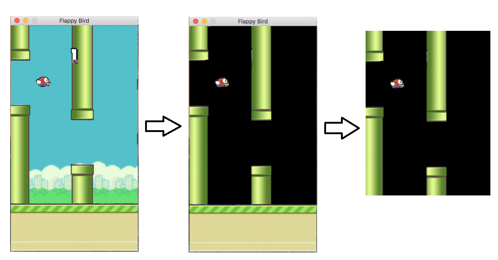
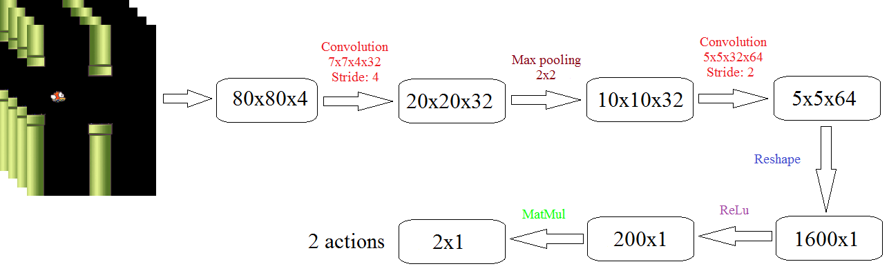

# An example of how to use DRL to play the game of Flappy Bird

## Overview
This project apply the technique of the Deep Q Learning algorithm proposed by Deepmind to the notorious Flappy Bird game.

## Installation Dependencies:
* Python 2.7
* TensorFlow
* pygame
* OpenCV-Python

## How to Run?
```
git clone https://github.com/SimonNgj/DRLexample1.git
cd DRLexample1
python mainNetwork.py
```

## Understand Deep Q-Network
Deep Q-Network is a end-to-end method of using convolutional neural network.

Please refer to this link if you want to learn more about DQN:
[Demystifying Deep Reinforcement Learning](http://www.nervanasys.com/demystifying-deep-reinforcement-learning/)

## Experiments

#### Environment
Since deep Q-network is trained on the raw pixel values observed from the game screen at each time step, [3] finds that remove the background appeared in the original game can make it converge faster. This process can be visualized as the following figure:



#### Network Architecture
According to [1], I first preprocessed the game screens with following steps:

1. Crop image
2. Convert image to grayscale
3. Resize image to 80x80
4. Stack last 4 frames to produce an 80x80x4 input array for network

The architecture of the network is shown in the figure below. The first layer convolves the input image with an 7x7x4x32 kernel at a stride size of 4. The output is then put through a 2x2 max pooling layer. The second layer convolves with a 5x5x32x64 kernel at a stride of 2. After that, we reshape to a matrix of n-by-1. The last hidden layer consists of 200 fully connected ReLU nodes, while the output is a matrix of 2-by-1. Here, number 2 represents to  actions: touch or nothing.



The final output layer has the same dimensionality as the number of valid actions which can be performed in the game, where the 0th index always corresponds to doing nothing. The values at this output layer represent the Q function given the input state for each valid action. At each time step, the network performs whichever action corresponds to the highest Q value using a ϵ greedy policy.

## Disclaimer
This work is highly based on the following repos:

1. [sourabhv/FlapPyBird] (https://github.com/sourabhv/FlapPyBird)
2. [asrivat1/DeepLearningVideoGames](https://github.com/asrivat1/DeepLearningVideoGames)
3. https://github.com/yenchenlin1994/DeepLearningFlappyBird.git

