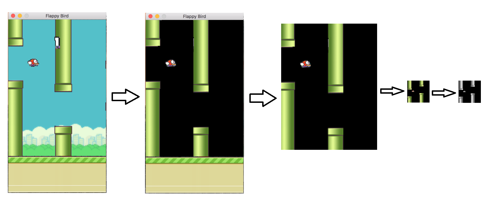

# An example of how to use DRL to play the game of Flappy Bird

## Overview
This project apply the technique of the Deep Q Learning algorithm proposed by Deepmind to the notorious Flappy Bird game.

## Installation Dependencies:
* Python 2.7
* TensorFlow
* pygame
* OpenCV-Python

## How to Run?
```
git clone https://github.com/SimonNgj/DRLexample1.git
cd DRLexample1
python mainNetwork.py
```

## Understand Deep Q-Network
Deep Q-Network is a end-to-end method of using convolutional neural network.

Please refer to this link if you want to learn more about DQN:
[Demystifying Deep Reinforcement Learning](http://www.nervanasys.com/demystifying-deep-reinforcement-learning/)

## Experiments

#### Environment
Since deep Q-network is trained on the raw pixel values observed from the game screen at each time step, [3] finds that remove the background appeared in the original game can make it converge faster. This process can be visualized as the following figure:



#### Network Architecture
According to [1], I first preprocessed the game screens with following steps:

1. Crop image
2. Convert image to grayscale
3. Resize image to 80x80
4. Stack last 4 frames to produce an 80x80x4 input array for network

The architecture of the network is shown in the figure below. The first layer convolves the input image with an 8x8x4x32 kernel at a stride size of 4. The output is then put through a 2x2 max pooling layer. The second layer convolves with a 4x4x32x64 kernel at a stride of 2. We then max pool again. The third layer convolves with a 3x3x64x64 kernel at a stride of 1. We then max pool one more time. The last hidden layer consists of 256 fully connected ReLU nodes.


The final output layer has the same dimensionality as the number of valid actions which can be performed in the game, where the 0th index always corresponds to doing nothing. The values at this output layer represent the Q function given the input state for each valid action. At each time step, the network performs whichever action corresponds to the highest Q value using a ϵ greedy policy.


#### Training
At first, I initialize all weight matrices randomly using a normal distribution with a standard deviation of 0.01, then set the replay memory with a max size of 250,00 experiences.

I start training by choosing actions uniformly at random for the first 10,000 time steps, without updating the network weights. This allows the system to populate the replay memory before training begins.

Note that unlike [1], which initialize ϵ = 1, I linearly anneal ϵ from 0.1 to 0.0001 over the course of the next 3000,000 frames. The reason why I set it this way is that agent can choose an action every 0.03s (FPS=30) in our game, high ϵ will make it **flap** too much and thus keeps itself at the top of the game screen and finally bump the pipe in a clumsy way. This condition will make Q function converge relatively slow since it only start to look other conditions when ϵ is low.
However, in other games, initialize ϵ to 1 is more reasonable.

During training time, at each time step, the network samples minibatches of size 32 from the replay memory to train on, and performs a gradient step on the loss function described above using the Adam optimization algorithm with a learning rate of 0.000001. After annealing finishes, the network continues to train indefinitely, with ϵ fixed at 0.001.

## Disclaimer
This work is highly based on the following repos:

1. [sourabhv/FlapPyBird] (https://github.com/sourabhv/FlapPyBird)
2. [asrivat1/DeepLearningVideoGames](https://github.com/asrivat1/DeepLearningVideoGames)
3. https://github.com/yenchenlin1994/DeepLearningFlappyBird.git

